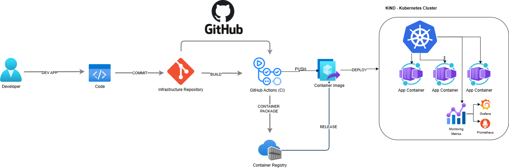

# Push-Based GitOps with KIND and Prometheus Monitoring

 

A complete implementation of push-based GitOps using KIND (Kubernetes IN Docker) clusters with comprehensive monitoring through the kube-prometheus-stack.

[](https://github.com/triplom/infrastructure-repo/actions/workflows/deploy-infrastructure.yaml)
[](https://github.com/triplom/infrastructure-repo/actions/workflows/deploy-apps.yaml)

## 📋 Table of Contents

- [Overview](#-overview)
- [Architecture](#️-architecture)
- [Prerequisites](#-prerequisites)
- [Getting Started](#-getting-started)
  - [Setting Up KIND Clusters](#setting-up-kind-clusters)
  - [Setting Up Self-Hosted Runners](#setting-up-self-hosted-runners)
  - [GitHub Container Registry Setup](#github-container-registry-setup)
  - [GitHub Repository Setup](#github-repository-setup)
- [Repository Structure](#-repository-structure)
- [Deployment Workflows](#-deployment-workflows)
  - [Infrastructure Deployment](#infrastructure-deployment)
  - [Monitoring Stack Deployment](#monitoring-stack-deployment)
  - [Application Deployment](#application-deployment)
  - [Cross-Repository Deployments](#cross-repository-deployments)
- [CI/CD Pipeline](#-cicd-pipeline)
- [Monitoring & Observability](#-monitoring--observability)
  - [Accessing Dashboards](#accessing-dashboards)
  - [Metrics & Alerts](#metrics--alerts)
- [Multi-Environment Strategy](#-multi-environment-strategy)
- [Troubleshooting](#-troubleshooting)
- [Security Best Practices](#-security-best-practices)
- [Contributing](#-contributing)
- [License](#-license)

## 🌐 Overview

This repository implements a push-based GitOps approach using GitHub Actions to deploy infrastructure and applications to Kubernetes clusters. Unlike pull-based GitOps solutions (like ArgoCD or Flux), this approach triggers deployments through CI/CD pipelines when changes are detected in the Git repository.

**Key Features:**

- Local KIND clusters for development, QA, and production environments
- Push-based GitOps using GitHub Actions workflows with self-hosted runners
- Cross-repository deployment integration for multi-repo architecture
- Comprehensive monitoring with Prometheus, Grafana, and AlertManager
- Multi-environment deployment strategy with proper separation of concerns
- Ingress management with cert-manager for SSL/TLS
- GitHub Container Registry for storing container images

## 🏛️ Architecture



The architecture consists of three main components:

1. **Source of Truth**: Git repository containing infrastructure and application configurations
2. **CI/CD Pipeline**: GitHub Actions workflows that detect changes and apply them
3. **Runtime**: KIND clusters running in Docker containers
4. **Self-Hosted Runners**: For direct cluster access from GitHub Actions

**Workflow:**

1. Developer commits changes to the repository
2. GitHub Actions detects changes and triggers appropriate workflows
3. Self-hosted runners execute deployment workflows with direct access to local clusters
4. CI/CD pipeline applies changes to the appropriate environment
5. Monitoring stack collects metrics and displays them in Grafana

## 🧰 Prerequisites

- [Docker](https://www.docker.com/get-started) (v20.10+)
- [kubectl](https://kubernetes.io/docs/tasks/tools/) (v1.24+)
- [kind](https://kind.sigs.k8s.io/docs/user/quick-start/#installation) (v0.20+)
- [Helm](https://helm.sh/docs/intro/install/) (v3.12+)
- [GitHub account](https://github.com/) with repository access
- [yq](https://github.com/mikefarah/yq) for YAML processing
- [GitHub CLI](https://cli.github.com/) (optional, for workflow triggering)
- [ngrok](https://ngrok.com/) (optional, for exposing local clusters to external services)

## 🚀 Getting Started

### Setting Up KIND Clusters

Clone the repository and run the KIND setup script:

```bash
git clone https://github.com/your-username/infrastructure-repo.git
cd infrastructure-repo
chmod +x kind/setup-kind.sh

# Create all clusters (dev, qa, prod)
./kind/setup-kind.sh

# Or create a specific environment
./kind/setup-kind.sh dev

# Force recreation of clusters
./kind/setup-kind.sh --force
```

This creates Kubernetes clusters based on your selection:

- `dev-cluster`: For development and testing
- `qa-cluster`: For quality assurance and pre-production
- `prod-cluster`: For production workloads

### Setting Up Self-Hosted Runners

For optimal cluster access, set up GitHub self-hosted runners on your local machine:

```bash
# Create a directory for the runner outside of your git repository
mkdir -p ~/actions-runner && cd ~/actions-runner

# Download the latest runner
# Fetch the latest version dynamically
LATEST_VERSION=$(curl -s https://api.github.com/repos/actions/runner/releases/latest | jq -r '.tag_name')
curl -o actions-runner-linux-x64-${LATEST_VERSION}.tar.gz -L https://github.com/actions/runner/releases/download/${LATEST_VERSION}/actions-runner-linux-x64-${LATEST_VERSION}.tar.gz

# Alternatively, ensure to check for the latest version manually:
# Visit https://github.com/actions/runner/releases to find the latest version.
tar xzf ./actions-runner-linux-x64-2.325.0.tar.gz

# Configure the runner (get your token from GitHub repository → Settings → Actions → Runners → New self-hosted runner)
./config.sh --url https://github.com/your-username/infrastructure-repo --token YOUR_TOKEN

# Last step, run it!
$ ./run.sh

## To get the token, you would:

## Go to your GitHub repository
## Navigate to Settings → Actions → Runners
## Click "New self-hosted runner"
## You'll see the setup instructions including the token value to use

```

```bash
Using your self-hosted runner
# Use this YAML in your workflow file for each job
runs-on: self-hosted
```

> ⚠️ **Important**: Never commit the runner files to your Git repository. Add `actions-runner/` to your `.gitignore` file.

### GitHub Container Registry Setup

Set up the GitHub Container Registry authentication:

```bash
chmod +x infrastructure/github-registry/github-setup.sh

# Set GitHub credentials as environment variables
export GITHUB_USERNAME="your-username"
export GITHUB_PAT="your-personal-access-token" # Use environment variables instead of hardcoding
export GITHUB_EMAIL="your-email@example.com"

# Run the GitHub Container Registry setup
./infrastructure/github-registry/github-setup.sh

# Verify setup
kubectl get secrets -n container-auth
```

### GitHub Repository Setup

1. Push the repository to GitHub
2. Configure GitHub Secrets for cluster access
   - Go to your GitHub repository → Settings → Secrets and Variables → Actions
   - Add the following secrets:
     - `KUBECONFIG_DEV`: Base64-encoded kubeconfig for dev cluster
     - `KUBECONFIG_QA`: Base64-encoded kubeconfig for QA cluster
     - `KUBECONFIG_PROD`: Base64-encoded kubeconfig for production cluster

   To encode your kubeconfig files:

```bash
# Linux
base64 -w 0 dev-cluster-kubeconfig > dev-cluster-kubeconfig-base64.txt

# macOS
base64 -i dev-cluster-kubeconfig -o dev-cluster-kubeconfig-base64.txt

# Copy the contents of dev-cluster-kubeconfig-base64.txt to the KUBECONFIG_DEV secret
```

## 📂 Repository Structure

```bash
infrastructure-repo/
├── .github/workflows/         # GitHub Actions workflow definitions
│   ├── ci-pipeline.yaml       # Build and test applications
│   ├── deploy-apps.yaml       # Deploy applications to clusters
│   ├── deploy-infrastructure.yaml # Deploy core infrastructure
│   └── deploy-monitoring.yaml # Deploy monitoring stack
├── apps/                      # Application manifests
│   └── app1/                  # Sample application
│       ├── base/              # Base manifests
│       └── overlays/          # Environment-specific overlays
├── infrastructure/            # Infrastructure components
│   ├── cert-manager/          # TLS certificate management
│   ├── ingress-nginx/         # Ingress controller
│   ├── monitoring/            # Prometheus & Grafana stack
│   └── github-registry/       # GitHub Container Registry setup
├── kind/                      # KIND cluster configurations
│   ├── clusters/              # Cluster config files
│   ├── setup-kind.sh          # Cluster creation script
│   └── monitoring-stack.sh    # Monitoring deployment script
├── logs/                      # Deployment logs (auto-generated)
└── src/                       # Application source code
```

## 🔄 Deployment Workflows

### Infrastructure Deployment

Deploy core infrastructure components using self-hosted runners:

```bash
# Manual trigger through GitHub UI
# Go to Actions → Deploy Infrastructure → Run workflow

# Or from command line (requires GitHub CLI)
gh workflow run deploy-infrastructure.yaml --ref main -F environment=dev -F component=all

# Deploy specific components
gh workflow run deploy-infrastructure.yaml --ref main -F environment=dev -F component=cert-manager
gh workflow run deploy-infrastructure.yaml --ref main -F environment=dev -F component=ingress-nginx
```

### Monitoring Stack Deployment

Deploy the Prometheus monitoring stack:

```bash
# Manual trigger
gh workflow run deploy-monitoring.yaml --ref main -F environment=dev
```

This deploys:

- Prometheus for metrics collection
- Grafana for visualization
- AlertManager for alerts
- Node Exporter and Kube State Metrics for enhanced monitoring

### Application Deployment

Deploy sample applications:

```bash
# Deploy all applications to dev
gh workflow run deploy-apps.yaml --ref main -F environment=dev

# Deploy a specific application to qa
gh workflow run deploy-apps.yaml --ref main -F environment=qa -F application=app1
```

### Cross-Repository Deployments

The enhanced workflow allows triggering deployments from external application repositories:

```bash
# From an external application repository
curl -X POST \
  -H "Authorization: token $GITHUB_PAT" \
  -H "Accept: application/vnd.github.v3+json" \
  https://api.github.com/repos/your-username/infrastructure-repo/dispatches \
  -d '{
    "event_type": "app-deployment-request",
    "client_payload": {
      "app_name": "my-application",
      "version": "v1.2.3",
      "repository": "your-username/app-repository",
      "ref": "main",
      "environment": "dev"
    }
  }'
```

This integration enables a true multi-repository architecture where each application can maintain its own code and deployment manifests while leveraging the centralized infrastructure deployment.

## 🔄 CI/CD Pipeline

The CI/CD pipeline consists of several workflows:

1. **CI Pipeline (`ci-pipeline.yaml`)**
   - Triggered on pushes to `main` and feature branches
   - Runs tests on application code
   - Builds Docker images and pushes to registry
   - Updates application manifests with new image tags

2. **Application Deployment (`deploy-apps.yaml`)**
   - Runs on self-hosted runners for direct cluster access
   - Deploys applications to Kubernetes clusters using multiple deployment methods
   - Supports cross-repository integration via repository_dispatch
   - Enhanced logging and artifact collection

3. **Infrastructure Deployment (`deploy-infrastructure.yaml`)**
   - Runs on self-hosted runners for direct cluster access
   - Deploys core infrastructure components
   - Manages cert-manager and ingress-nginx
   - Support for multiple environments

4. **Monitoring Stack Deployment (`deploy-monitoring.yaml`)**
   - Deploys Prometheus, Grafana, and AlertManager
   - Configures dashboards and alerting rules
   - Environment-specific configurations

## 📊 Monitoring & Observability

### Accessing Dashboards

After deployment, access the dashboards using port-forwarding:

#### Grafana

```bash
# Using the service
kubectl --context kind-dev-cluster -n monitoring port-forward svc/kube-prometheus-stack-grafana 3000:80

# Direct pod access (if service access fails)
export POD_NAME=$(kubectl --namespace monitoring get pod -l "app.kubernetes.io/name=grafana,app.kubernetes.io/instance=kube-prometheus-stack" -oname)
kubectl --namespace monitoring port-forward $POD_NAME 3000
```

Then visit <http://localhost:3000> in your browser (default credentials: admin/gitops-admin)

#### Prometheus

```bash
kubectl --context kind-dev-cluster -n monitoring port-forward svc/kube-prometheus-stack-prometheus 9090:9090
```

Then visit <http://localhost:9090> in your browser

#### AlertManager

```bash
kubectl --context kind-dev-cluster -n monitoring port-forward svc/kube-prometheus-stack-alertmanager 9093:9093
```

Then visit <http://localhost:9093> in your browser

### Metrics & Alerts

The monitoring stack includes:

- **System metrics**: CPU, memory, disk, network usage
- **Kubernetes metrics**: Pod status, deployment status
- **Application metrics**: Custom metrics exposed by applications
- **Pre-configured alerts**: High CPU/memory usage, pod crashes, etc.

## 🌍 Multi-Environment Strategy

This repository follows a multi-environment strategy:

1. **Development** (`dev`):
   - Fast deployments
   - Minimal resources
   - Debug-level logging
   - Automatic deployments on main branch changes

2. **QA/Testing** (`qa`):
   - More resources for testing
   - More replicas for resilience testing
   - Integration tests
   - Manual approval for deployments

3. **Production** (`prod`):
   - Maximum resources
   - Multiple replicas
   - Production-level logging
   - Stricter security settings
   - Required approvals for deployments

## 🔍 Troubleshooting

### Common Issues

#### Workflow Failure

1. Check if the kubeconfig secrets are properly configured
2. Verify the cluster is running with `kind get clusters`
3. Check workflow logs in GitHub Actions
4. Verify your self-hosted runner is active and connected
5. Add `--validate=false` to kubectl commands in CI/CD environments
6. Verify namespace exists before deploying resources

#### Self-Hosted Runner Issues

1. Check runner status: `sudo ./svc.sh status`
2. Review runner logs: `cat ~/actions-runner/_diag/*.log`
3. Ensure the runner has network access to both GitHub and your local Kubernetes clusters
4. Verify the runner has installed the required tools (kubectl, kustomize, helm)

#### Exposing Local Clusters with ngrok

For external access or connecting CI/CD services to local clusters:

```bash
# Start ngrok to expose the Kubernetes API server
ngrok http https://localhost:6443

# Update your kubeconfig with the ngrok URL
kubectl config set-cluster kind-dev-cluster --server=https://your-ngrok-url.ngrok.io

# Create a GitHub secret with this updated kubeconfig
```

#### Image Pulling Issues

1. Ensure the local registry is running: `docker ps | grep registry`
2. Check if the image exists: `docker images | grep app1`
3. Verify registry connectivity from clusters: `curl -X GET http://localhost:5000/v2/_catalog`
4. Check if container runtime is configured correctly: `docker exec <node-name> cat /etc/containerd/certs.d/localhost:5000/hosts.toml`

#### Monitoring Stack Issues

1. Verify the Helm release: `helm list -n monitoring`
2. Check Prometheus pods: `kubectl -n monitoring get pods | grep prometheus`
3. Check Grafana logs: `kubectl -n monitoring logs deploy/kube-prometheus-stack-grafana -c grafana`
4. Verify ConfigMaps are properly created: `kubectl -n monitoring get cm`

## 🔒 Security Best Practices

1. **Secure Secrets Management**:
   - Never commit kubeconfig files or credentials to the repository
   - Use GitHub Secrets for sensitive information
   - Consider tools like Sealed Secrets for Kubernetes secrets

2. **Access Control**:
   - Use least privilege principle for CI/CD workflows
   - Set appropriate environment protections in GitHub
   - Implement proper approvals for production deployments

3. **Container Security**:
   - Scan images for vulnerabilities
   - Use minimal base images
   - Don't run containers as root

4. **Network Security**:
   - Use network policies to restrict traffic
   - Expose services only when necessary
   - Configure proper TLS with cert-manager

5. **Token Management**:
   - Never hardcode tokens in scripts or workflows
   - Use environment variables for sensitive values
   - Implement pre-commit hooks to prevent accidental credential commits

## 👨‍💻 Contributing

Contributions are welcome! Please follow these steps:

1. Fork the repository
2. Create a feature branch: `git checkout -b feature/my-new-feature`
3. Make your changes and commit: `git commit -am 'Add some feature'`
4. Push to the branch: `git push origin feature/my-new-feature`
5. Submit a pull request

For local development, you can use the provided scripts:

```bash
# Setup development environment
./kind/setup-kind.sh dev
./infrastructure/local-registry/setup-registry.sh

# Validate code
# Install pre-commit hooks for validation
pip install pre-commit
pre-commit install

# Add security scanning to prevent token commits
cat >> .pre-commit-config.yaml << EOF
- repo: https://github.com/zricethezav/gitleaks
  rev: v8.18.1
  hooks:
  - id: gitleaks
EOF
```

Check the [CONTRIBUTING](docs/CONTRIBUTING.md) file for details

## 📄 License

This project is licensed under the MIT License - see the [LICENSE](LICENSE) file for details.

---.
