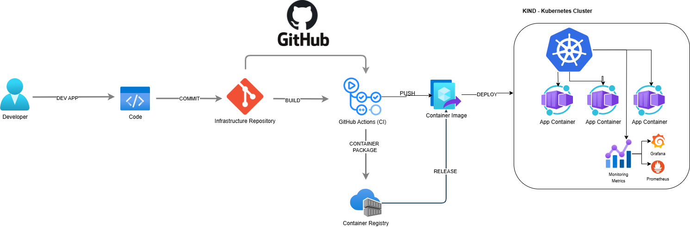

# infrastructure-repo — Push-Based GitOps (CI/CD)

> **MSc Thesis companion repository** · *GitOps Efficiency with ArgoCD Automation*
> Marcel Marques Martins · ISCTE – Instituto Universitário de Lisboa · December 2024

This repository implements the **push-based continuous delivery** scenario used as the control group in the thesis evaluation (Chapters 5 & 6). The CI/CD pipeline builds container images and applies Kubernetes manifests directly to the target cluster — no GitOps operator is involved. Compare with [`infrastructure-repo-argocd`](https://github.com/triplom/infrastructure-repo-argocd) for the pull-based GitOps approach.



---

## Architecture

```
┌─────────────────────────────────────────────────────────────┐
│                     Push-Based CD Flow                       │
│                                                             │
│  Git push → GitHub Actions CI → Build image → Push to Hub  │
│                    ↓                                        │
│         kubectl apply → Kubernetes cluster                  │
│                                                             │
│  Pipeline owns cluster state. No reconciliation loop.       │
└─────────────────────────────────────────────────────────────┘
```

**Key characteristics vs pull-based GitOps:**
- The CI pipeline directly applies manifests (`kubectl apply`) on every run
- No operator watches the cluster — drift is not automatically corrected
- Credentials (kubeconfig) must be available in CI secrets
- Environment promotion is explicit: each step pushes to the next cluster

---

## Repository Structure

```
infrastructure-repo/
├── .github/
│   └── workflows/
│       ├── deploy-infrastructure.yaml   # Provision cert-manager + ingress-nginx
│       ├── deploy-monitoring.yaml       # Prometheus + Grafana + Alertmanager
│       ├── deploy-apps.yaml             # Build images → push to Docker Hub → kubectl apply
│       └── promote-apps.yaml            # Promote image tag dev → qa → prod
├── apps/
│   ├── app1/                            # Python Flask app (base + dev/qa/prod overlays)
│   ├── app2/                            # Python Flask app (base + dev/qa/prod overlays)
│   ├── external-app1/                   # External app (base + dev/qa/prod overlays)
│   └── external-app2/                   # External app (base + dev/qa/prod overlays)
├── infrastructure/
│   ├── cert-manager/                    # cert-manager (base + overlays)
│   ├── ingress-nginx/                   # NGINX Ingress Controller (base + overlays)
│   ├── monitoring/                      # kube-prometheus-stack (base + overlays)
│   └── github-registry/                 # Container registry helpers
├── kind/
│   ├── clusters/                        # KIND cluster config files (dev/qa/prod)
│   ├── setup-kind.sh                    # Provision local KIND clusters
│   └── monitoring-stack.sh              # Install monitoring on a cluster
├── templates/
│   └── simple-app/                      # Reusable Kustomize app template
├── docs/
│   └── CONTRIBUTING.md
├── Makefile                             # Common tasks shortcut
└── .pre-commit-config.yaml
```

---

## CI/CD Workflows

All workflows require `DOCKERHUB_USERNAME` and `DOCKERHUB_TOKEN` secrets. For cluster access, set a `KUBECONFIG` secret (base64-encoded kubeconfig). Without `KUBECONFIG` the workflows run in simulation mode and skip `kubectl` steps.

### 1. Deploy Infrastructure (`deploy-infrastructure.yaml`)

Validates Kustomize manifests and applies cert-manager and ingress-nginx directly to the target cluster.

**Triggers:** push to `main` affecting `kind/**` or `infrastructure/cert-manager/**` or `infrastructure/ingress-nginx/**`; manual dispatch.

```
validate → deploy cert-manager → deploy ingress-nginx → verify cluster state
```

### 2. Deploy Monitoring (`deploy-monitoring.yaml`)

Installs the `kube-prometheus-stack` (Prometheus + Grafana + Alertmanager) via Helm or Kustomize.

**Triggers:** push to `main` affecting `infrastructure/monitoring/**`; manual dispatch.

```
validate → create monitoring namespace → helm upgrade --install kube-prometheus-stack
```

### 3. Deploy Apps (`deploy-apps.yaml`)

Builds Docker images for `app1` and `app2`, pushes to Docker Hub, then applies the Kustomize overlay for the target environment directly to the cluster.

**Triggers:** push to `main` affecting `apps/**`; pull requests; manual dispatch.

```
build (matrix: app1, app2) → deploy to cluster (kubectl apply -k overlays/<env>)
```

### 4. Promote Apps (`promote-apps.yaml`)

Updates the image tag in the target environment's `kustomization.yaml`, commits the change, then applies it directly to the target cluster.

**Triggers:** manual dispatch (choose source/target env and image tag); auto-triggered after `deploy-apps` succeeds.

```
resolve tag → update kustomization → commit → kubectl apply to target cluster
```

---

## Local Setup

### Prerequisites

```bash
# Install required tools
brew install kind kubectl kustomize helm   # macOS
# or apt-get / dnf equivalents on Linux
```

### Provision KIND clusters

```bash
# Create dev, qa, prod clusters
./kind/setup-kind.sh

# Or a single environment
./kind/setup-kind.sh dev

# Force recreate
./kind/setup-kind.sh --force prod
```

### Deploy infrastructure

```bash
# All in one
make setup

# Or step by step
kubectl config use-context kind-dev-cluster
kustomize build infrastructure/cert-manager/base | kubectl apply -f -
kustomize build infrastructure/ingress-nginx/overlays/dev | kubectl apply -f -
```

### Deploy monitoring

```bash
make setup-monitoring
# or
./kind/monitoring-stack.sh dev
```

### Deploy applications

```bash
make deploy
# or
kubectl apply -k apps/app1/overlays/dev
kubectl apply -k apps/app2/overlays/dev
```

### Makefile reference

| Command | Description |
|---|---|
| `make setup` | Create all KIND clusters |
| `make setup-monitoring` | Install monitoring stack on dev |
| `make deploy` | Apply app1 + app2 to dev cluster |
| `make test` | Run application tests |
| `make clean` | Delete all KIND clusters |

---

## Multi-Environment Strategy

Three environments are supported: **dev**, **qa**, **prod**. Each has:
- A dedicated KIND cluster (`kind-dev-cluster`, `kind-qa-cluster`, `kind-prod-cluster`)
- Kustomize overlays under `apps/<app>/overlays/<env>/`
- Infrastructure overlays under `infrastructure/<component>/overlays/<env>/`

**Promotion flow (push-based):**

```
dev cluster ──(promote-apps)──▶ qa cluster ──(promote-apps)──▶ prod cluster
```

Each promotion step:
1. Updates `newTag` in the target overlay's `kustomization.yaml`
2. Commits the change to Git
3. Runs `kubectl apply` against the target cluster directly

---

## Secrets Required

| Secret | Value | Used by |
|---|---|---|
| `DOCKERHUB_USERNAME` | `triplom` | `deploy-apps.yaml` |
| `DOCKERHUB_TOKEN` | Docker Hub PAT | `deploy-apps.yaml` |
| `KUBECONFIG` | base64-encoded kubeconfig | All deploy workflows |
| `PAT` | GitHub PAT (for cross-repo commits) | `promote-apps.yaml` |

Generate the kubeconfig secret:
```bash
cat ~/.kube/config | base64 -w0 | gh secret set KUBECONFIG --repo triplom/infrastructure-repo
```

---

## Comparison with Pull-Based GitOps

| Aspect | Push-Based (this repo) | Pull-Based ([infrastructure-repo-argocd](https://github.com/triplom/infrastructure-repo-argocd)) |
|---|---|---|
| Who applies manifests | CI pipeline (`kubectl apply`) | ArgoCD operator (pull from Git) |
| Cluster credentials in CI | Required (`KUBECONFIG` secret) | Not required after bootstrap |
| Drift correction | None — manual re-run needed | Automatic (ArgoCD self-heals) |
| Deployment trigger | Pipeline run | Git commit detected by ArgoCD |
| Promotion mechanism | CI applies to next cluster | CI commits to Git; ArgoCD syncs |
| Audit trail | GitHub Actions logs | Git history + ArgoCD UI |
| Setup complexity | Low (no operator) | Higher (ArgoCD bootstrap) |

See Chapter 6 of the thesis for quantitative evaluation metrics.

---

## Container Images

Images are pushed to Docker Hub under `triplom/`:

| Application | Image |
|---|---|
| app1 | `triplom/app1:<sha-tag>` |
| app2 | `triplom/app2:<sha-tag>` |
| external-app1 | `triplom/external-app1:<sha-tag>` |
| external-app2 | `triplom/external-app2:<sha-tag>` |

---

## Monitoring Stack

The monitoring stack deploys `kube-prometheus-stack` into the `monitoring` namespace:

- **Prometheus** — metrics collection and alerting
- **Grafana** — dashboards (default credentials: `admin/admin`)
- **Alertmanager** — alert routing

Access Grafana locally:
```bash
kubectl port-forward svc/kube-prometheus-stack-grafana -n monitoring 3000:80
# open http://localhost:3000
```

---

## Related Repositories

| Repository | Purpose |
|---|---|
| [`infrastructure-repo`](https://github.com/triplom/infrastructure-repo) | This repo — push-based CD |
| [`infrastructure-repo-argocd`](https://github.com/triplom/infrastructure-repo-argocd) | Pull-based GitOps with ArgoCD |

---

## License

MIT — see [LICENSE](LICENSE).
