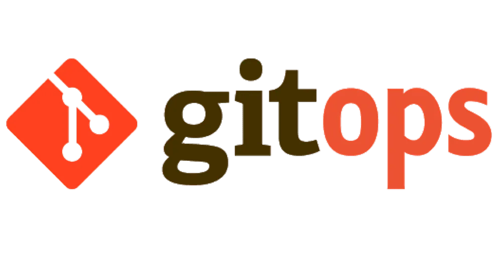

# Push-Based GitOps with KIND and Prometheus Monitoring

 

A complete implementation of push-based GitOps using KIND (Kubernetes IN Docker) clusters with comprehensive monitoring, multi-application support, and cross-repository deployment capabilities.

[](https://github.com/triplom/infrastructure-repo/actions/workflows/deploy-infrastructure.yaml)
[](https://github.com/triplom/infrastructure-repo/actions/workflows/deploy-apps.yaml)
[](https://github.com/triplom/infrastructure-repo/actions/workflows/ci-pipeline.yaml)

## 📋 Table of Contents

- [Overview](#-overview)
- [Architecture](#️-architecture)
- [Prerequisites](#-prerequisites)
- [Getting Started](#-getting-started)
  - [Setting Up KIND Clusters](#setting-up-kind-clusters)
  - [Setting Up Self-Hosted Runners](#setting-up-self-hosted-runners)
  - [GitHub Container Registry Setup](#github-container-registry-setup)
  - [GitHub Repository Setup](#github-repository-setup)
- [Repository Structure](#-repository-structure)
- [Deployment Workflows](#-deployment-workflows)
  - [Infrastructure Deployment](#infrastructure-deployment)
  - [Monitoring Stack Deployment](#monitoring-stack-deployment)
  - [Application Deployment](#application-deployment)
  - [Cross-Repository Deployments](#cross-repository-deployments)
- [CI/CD Pipeline](#-cicd-pipeline)
  - [Multi-Application Support](#multi-application-support)
  - [Environment Promotion](#environment-promotion)
  - [Automated Testing](#automated-testing)
- [Monitoring & Observability](#-monitoring--observability)
  - [Accessing Dashboards](#accessing-dashboards)
  - [Metrics & Alerts](#metrics--alerts)
- [Multi-Environment Strategy](#-multi-environment-strategy)
- [Troubleshooting](#-troubleshooting)
- [Security Best Practices](#-security-best-practices)
- [Contributing](#-contributing)
- [License](#-license)

## 🌐 Overview

This repository implements a comprehensive push-based GitOps approach using GitHub Actions to deploy infrastructure and applications to Kubernetes clusters. Unlike pull-based GitOps solutions (like ArgoCD or Flux), this approach triggers deployments through CI/CD pipelines when changes are detected in the Git repository.

**Key Features:**

- **Multi-Environment Support**: Local KIND clusters for development, QA, and production environments
- **Push-Based GitOps**: GitHub Actions workflows with self-hosted runners for direct cluster access
- **Multi-Application Architecture**: Support for app1, app2, and k8s-web-app-php with independent deployment
- **Cross-Repository Integration**: Deploy applications from external repositories to centralized infrastructure
- **Environment Promotion**: Automated promotion flow (dev → qa → prod) with image tag management
- **Comprehensive Monitoring**: Prometheus, Grafana, and AlertManager with pre-configured dashboards
- **Advanced CI/CD**: Matrix builds, change detection, and component-specific deployments
- **Security**: GitHub Container Registry integration with proper secret management

## 🏛️ Architecture


The architecture consists of multiple components working together:

### **Infrastructure Layer**

- **KIND Clusters**: `kind-dev-cluster`, `kind-qa-cluster`, `kind-prod-cluster`
- **Container Registry**: GitHub Container Registry (ghcr.io)
- **Self-Hosted Runners**: Direct cluster access for deployments

### **Application Layer**

- **app1**: Python-based application with pytest testing
- **app2**: Multi-language application (Python/Node.js support)
- **k8s-web-app-php**: Symfony/Sylius e-commerce platform with dual containers (PHP-FPM + Nginx)

### **CI/CD Pipeline**

- **Change Detection**: Automatic detection of modified applications
- **Matrix Builds**: Parallel building of changed applications
- **Environment Promotion**: Controlled promotion between environments
- **Cross-Repository**: External app deployment via repository dispatch

**Deployment Flow:**

1. Developer commits changes to application repository
2. CI pipeline detects changes and builds affected applications
3. Docker images are pushed to GitHub Container Registry
4. Deployment workflow applies changes to appropriate environment
5. Monitoring stack tracks deployment status and application health
6. Promotion workflow manages image promotion between environments

## 🧰 Prerequisites

- [Docker](https://www.docker.com/get-started) (v20.10+)
- [kubectl](https://kubernetes.io/docs/tasks/tools/) (v1.24+)
- [kind](https://kind.sigs.k8s.io/docs/user/quick-start/#installation) (v0.20+)
- [Helm](https://helm.sh/docs/intro/install/) (v3.12+)
- [Kustomize](https://kustomize.io/) (v4.5+)
- [GitHub account](https://github.com/) with repository access
- [yq](https://github.com/mikefarah/yq) for YAML processing
- [GitHub CLI](https://cli.github.com/) (optional, for workflow triggering)
- [jq](https://stedolan.jq.io/) for JSON processing

## 🚀 Getting Started

### Setting Up KIND Clusters

Clone the repository and create the KIND clusters:

```bash
git clone https://github.com/triplom/infrastructure-repo.git
cd infrastructure-repo
chmod +x kind/setup-kind.sh

# Create all clusters (dev, qa, prod)
./kind/setup-kind.sh

# Or create a specific environment
./kind/setup-kind.sh dev

# Force recreation of clusters
./kind/setup-kind.sh --force
```

This creates three Kubernetes clusters:

- `kind-dev-cluster`: Development environment
- `kind-qa-cluster`: Quality assurance environment  
- `kind-prod-cluster`: Production environment

### Setting Up Self-Hosted Runners

For optimal cluster access, set up GitHub self-hosted runners:

```bash
# Create a directory for the runner outside of your git repository
mkdir -p ~/actions-runner && cd ~/actions-runner

# Download the latest runner
LATEST_VERSION=$(curl -s https://api.github.com/repos/actions/runner/releases/latest | jq -r '.tag_name')
curl -o actions-runner-linux-x64-${LATEST_VERSION}.tar.gz -L https://github.com/actions/runner/releases/download/${LATEST_VERSION}/actions-runner-linux-x64-${LATEST_VERSION}.tar.gz

tar xzf ./actions-runner-linux-x64-*.tar.gz

# Configure the runner (get your token from GitHub repository → Settings → Actions → Runners)
./config.sh --url https://github.com/triplom/infrastructure-repo --token YOUR_TOKEN

# Run the runner
./run.sh

# Optional: Install as a service
sudo ./svc.sh install
sudo ./svc.sh start
```

> ⚠️ **Important**: Never commit the runner files to your Git repository. Add `actions-runner/` to your `.gitignore` file.

### GitHub Container Registry Setup

Set up the GitHub Container Registry authentication:

```bash
chmod +x infrastructure/github-registry/github-setup.sh

# Set GitHub credentials as environment variables
export GITHUB_USERNAME="triplom"
export GITHUB_PAT="your-personal-access-token"
export GITHUB_EMAIL="your-email@example.com"

# Run the GitHub Container Registry setup
./infrastructure/github-registry/github-setup.sh

# Verify setup
kubectl get secrets -n container-auth
```

### GitHub Repository Setup

1. **Configure Repository Secrets**:

   > Go to your GitHub repository → Settings → Secrets and Variables → Actions and add:

   ```bash
   # Cluster access secrets
   KUBECONFIG_DEV: Base64-encoded kubeconfig for dev cluster
   KUBECONFIG_QA: Base64-encoded kubeconfig for QA cluster  
   KUBECONFIG_PROD: Base64-encoded kubeconfig for production cluster
   
   # Cross-repository deployment token
   INFRA_REPO_PAT: Personal Access Token with repo and workflow permissions
   ```

2. **Encode kubeconfig files**:

   ```bash
   # Get kubeconfig for each cluster
   kind get kubeconfig --name dev-cluster > dev-cluster-kubeconfig
   kind get kubeconfig --name qa-cluster > qa-cluster-kubeconfig
   kind get kubeconfig --name prod-cluster > prod-cluster-kubeconfig
   
   # Encode for GitHub secrets
   base64 -w 0 dev-cluster-kubeconfig > dev-cluster-kubeconfig-base64.txt
   base64 -w 0 qa-cluster-kubeconfig > qa-cluster-kubeconfig-base64.txt
   base64 -w 0 prod-cluster-kubeconfig > prod-cluster-kubeconfig-base64.txt
   ```

## 📂 Repository Structure

```bash
infrastructure-repo/
├── .github/workflows/              # GitHub Actions workflow definitions
│   ├── ci-pipeline.yaml           # Multi-app CI/CD with promotion
│   ├── deploy-apps.yaml           # Enhanced app deployment with external repo support
│   ├── deploy-infrastructure.yaml # Core infrastructure deployment
│   └── deploy-monitoring.yaml     # Monitoring stack deployment
├── apps/                          # Application manifests
│   ├── app1/                      # Python application
│   │   ├── base/                  # Base Kubernetes manifests
│   │   └── overlays/              # Environment-specific overlays
│   │       ├── dev/
│   │       ├── qa/
│   │       └── prod/
│   ├── app2/                      # Multi-language application
│   │   ├── base/                  # Base Kubernetes manifests
│   │   └── overlays/              # Environment-specific overlays
│   │       ├── dev/
│   │       ├── qa/
│   │       └── prod/
│   └── k8s-web-app-php/          # Symfony/Sylius e-commerce app
│       ├── base/
│       │   ├── deployment.yaml    # Dual container deployment
│       │   ├── service.yaml
│       │   └── kustomization.yaml
│       └── overlays/
├── infrastructure/                # Infrastructure components
│   ├── cert-manager/             # TLS certificate management
│   ├── ingress-nginx/            # Ingress controller
│   ├── monitoring/               # Prometheus & Grafana stack
│   └── github-registry/          # GitHub Container Registry setup
├── kind/                         # KIND cluster configurations
│   ├── clusters/                 # Cluster config files
│   │   ├── dev-cluster.yaml
│   │   ├── qa-cluster.yaml
│   │   └── prod-cluster.yaml
│   ├── setup-kind.sh            # Cluster creation script
│   └── monitoring-stack.sh      # Monitoring deployment script
└── logs/                        # Deployment logs (auto-generated)
```

## 🔄 Deployment Workflows

### Infrastructure Deployment

Deploy core infrastructure components:

```bash
# Manual trigger through GitHub UI
# Go to Actions → Deploy Infrastructure → Run workflow

# Or using GitHub CLI
gh workflow run deploy-infrastructure.yaml \
  --ref main \
  -F environment=dev \
  -F component=all

# Deploy specific components
gh workflow run deploy-infrastructure.yaml \
  --ref main \
  -F environment=dev \
  -F component=cert-manager
```

### Monitoring Stack Deployment

Deploy the comprehensive monitoring stack:

```bash
# Deploy monitoring to dev environment
gh workflow run deploy-monitoring.yaml \
  --ref main \
  -F environment=dev
```

This deploys:

- **Prometheus**: Metrics collection and storage
- **Grafana**: Visualization and dashboards
- **AlertManager**: Alert routing and management
- **Node Exporter**: Host metrics collection
- **Kube State Metrics**: Kubernetes object metrics

### Application Deployment

Deploy applications with enhanced capabilities:

```bash
# Deploy all applications to dev (automatic on main push)
gh workflow run deploy-apps.yaml \
  --ref main \
  -F environment=dev

# Deploy specific application to qa
gh workflow run deploy-apps.yaml \
  --ref main \
  -F environment=qa \
  -F application=k8s-web-app-php
```

### Cross-Repository Deployments

The enhanced workflow supports deployment from external application repositories:

**From k8s-web-app-php repository:**

```bash
# Automatic deployment on push to main
git push origin main

# Manual deployment to specific environment
gh workflow run trigger-deployment.yml \
  --ref main \
  -F environment=qa \
  -F version=v1.2.3
```

**Repository dispatch integration:**

```bash
curl -X POST \
  -H "Authorization: token $GITHUB_PAT" \
  -H "Accept: application/vnd.github.v3+json" \
  https://api.github.com/repos/triplom/infrastructure-repo/dispatches \
  -d '{
    "event_type": "app-deployment-request",
    "client_payload": {
      "app_name": "k8s-web-app-php",
      "repository": "triplom/k8s-web-app-php",
      "version": "abc123def456",
      "environment": "dev",
      "triggered_by": "developer"
    }
  }'
```

## 🔄 CI/CD Pipeline

### Multi-Application Support

The CI/CD pipeline supports multiple applications with intelligent change detection:

```yaml
# Applications supported:
- app1: Python application with pytest
- app2: Multi-language (Python/Node.js)  
- k8s-web-app-php: Symfony/Sylius with dual containers
```

**Features:**

- **Change Detection**: Only builds applications that have changed
- **Matrix Builds**: Parallel building of multiple applications
- **Component Filtering**: Deploy specific applications or all at once
- **Cross-Repository**: External applications can trigger deployments

### Environment Promotion

Automated promotion flow between environments:

```bash
# Promotion Flow: dev → qa → prod

# Promote from dev to qa
gh workflow run ci-pipeline.yaml \
  --ref main \
  -F environment=qa \
  -F component=all \
  -F action=promote

# Promote from qa to prod  
gh workflow run ci-pipeline.yaml \
  --ref main \
  -F environment=prod \
  -F component=k8s-web-app-php \
  -F action=promote
```

**Promotion Process:**

1. Extracts image tags from source environment
2. Updates target environment with promoted tags
3. Commits changes to infrastructure repository
4. Triggers deployment to target environment
5. Validates deployment success

### Automated Testing

Comprehensive testing for each application type:

**app1 (Python):**

```bash
pip install -r requirements.txt
pip install pytest pytest-cov
pytest --cov=./ --cov-report=xml
```

**app2 (Multi-language):**

```bash
# Python support
pip install -r requirements.txt && pytest

# Node.js support  
npm install && npm test
```

**k8s-web-app-php (Symfony/Sylius):**

```bash
composer install --no-dev --optimize-autoloader
vendor/bin/phpunit  # or bin/phpunit
```

## 📊 Monitoring & Observability

### Accessing Dashboards

After deployment, access monitoring dashboards:

#### Grafana

```bash
kubectl --context kind-dev-cluster -n monitoring \
  port-forward svc/kube-prometheus-stack-grafana 3000:80
```

Visit: [http://localhost:3000](http://localhost:3000) (admin/gitops-admin)

#### Prometheus

```bash
kubectl --context kind-dev-cluster -n monitoring \
  port-forward svc/kube-prometheus-stack-prometheus 9090:9090
```

Visit: [http://localhost:9090](http://localhost:9090)

#### AlertManager

```bash
kubectl --context kind-dev-cluster -n monitoring \
  port-forward svc/kube-prometheus-stack-alertmanager 9093:9093
```

Visit: [http://localhost:9093](http://localhost:9093)

### Metrics & Alerts

**Pre-configured Dashboards:**

- Kubernetes cluster overview
- Node and pod resource usage
- Application-specific metrics
- Deployment and rollout status
- Network and storage metrics

**Alert Rules:**

- High CPU/memory usage
- Pod crash loops
- Deployment failures
- Persistent volume issues
- Node unavailability

## 🌍 Multi-Environment Strategy

### Environment Configuration

| Environment | Cluster | Purpose | Deployment Trigger |
|-------------|---------|---------|-------------------|
| **dev** | `kind-dev-cluster` | Development & testing | Automatic on main push |
| **qa** | `kind-qa-cluster` | Quality assurance | Manual or promotion |
| **prod** | `kind-prod-cluster` | Production workloads | Manual promotion only |

### Resource Allocation

**Development:**

- Minimal replicas (1)
- Lower resource limits
- Debug logging enabled
- Fast deployment cycles

**QA:**

- Moderate replicas (2)
- Production-like resources
- Integration testing
- Staging data

**Production:**

- High availability (3+ replicas)
- Maximum resource allocation
- Production logging
- Real user data

## 🔍 Troubleshooting

### Common Issues

#### Workflow Failures

**Issue**: Repository dispatch fails with "Resource not accessible"

```bash
# Solution: Check token permissions
# Ensure INFRA_REPO_PAT has 'repo' and 'workflow' scopes

# Debug token availability
if [ -z "${{ secrets.INFRA_REPO_PAT }}" ]; then
  echo "Token not available"
fi
```

**Issue**: Kustomize patch errors

```bash
# Error: no matches for Id Deployment.v1.apps/app-name
# Solution: Verify deployment names match between base and patches

# Check deployment name in base
grep -A 5 "kind: Deployment" apps/app/base/deployment.yaml

# Check patch target
grep -A 5 "kind: Deployment" apps/app/overlays/env/patches.yaml
```

#### Cross-Repository Deployment Issues

**Issue**: External app not found in apps directory

```bash
# Solution: Ensure "Prepare External App" step copies files correctly
# Check if k8s directory exists in external repo
ls -la external-app/k8s/

# Verify kustomization files are copied
find apps/app-name -name "kustomization.yaml"
```

**Issue**: Image version not updating

```bash
# Solution: Check image tag replacement in temporary directory
# Verify kustomize edit commands succeed
kustomize edit set image "app=ghcr.io/user/app:version"
```

#### Self-Hosted Runner Issues

**Issue**: Runner not connecting to clusters

```bash
# Check runner status
sudo ./svc.sh status

# Verify cluster access
kubectl --context kind-dev-cluster get nodes

# Check runner logs
cat ~/actions-runner/_diag/*.log
```

**Issue**: Missing tools on runner

```bash
# Install required tools
sudo apt-get update
sudo apt-get install -y kubectl

# Install kustomize
curl -s "https://raw.githubusercontent.com/kubernetes-sigs/kustomize/master/hack/install_kustomize.sh" | bash
sudo mv kustomize /usr/local/bin/

# Install helm
curl https://raw.githubusercontent.com/helm/helm/main/scripts/get-helm-3 | bash
```

#### Application-Specific Issues

**k8s-web-app-php Issues:**

```bash
# Check dual container deployment
kubectl get pods -n k8s-web-app-php-dev
kubectl describe pod <pod-name> -n k8s-web-app-php-dev

# Verify image pull secrets
kubectl get secrets -n k8s-web-app-php-dev

# Check container logs
kubectl logs <pod-name> -c php-fpm -n k8s-web-app-php-dev
kubectl logs <pod-name> -c nginx -n k8s-web-app-php-dev
```

### Debug Commands

```bash
# Check workflow status
gh run list --workflow=ci-pipeline.yaml

# View workflow logs
gh run view <run-id> --log

# Check cluster status
kubectl get nodes --context kind-dev-cluster
kubectl get pods --all-namespaces --context kind-dev-cluster

# Verify image registry
curl -X GET http://localhost:5000/v2/_catalog
```

## 🔒 Security Best Practices

### Secret Management

1. **GitHub Secrets**:

   ```bash
   # Never commit sensitive data
   echo "*.kubeconfig" >> .gitignore
   echo "*.pem" >> .gitignore
   echo ".env" >> .gitignore
   
   # Use environment variables in scripts
   export GITHUB_PAT="${GITHUB_PAT}"
   export KUBECONFIG="${KUBECONFIG}"
   ```

2. **Token Rotation**:

   ```bash
   # Regularly rotate Personal Access Tokens
   # Use GitHub Apps for better security
   # Implement token expiration policies
   ```

### Container Security

1. **Image Scanning**:

   ```yaml
   # Add to CI pipeline
   - name: Scan Docker image
     uses: aquasecurity/trivy-action@master
     with:
       image-ref: 'ghcr.io/triplom/app:${{ github.sha }}'
       format: 'sarif'
       output: 'trivy-results.sarif'
   ```

2. **Security Policies**:

   ```yaml
   # Pod Security Standards
   apiVersion: v1
   kind: Namespace
   metadata:
     labels:
       pod-security.kubernetes.io/enforce: restricted
       pod-security.kubernetes.io/audit: restricted
       pod-security.kubernetes.io/warn: restricted
   ```

### Access Control

1. **RBAC Configuration**:

   ```yaml
   # Least privilege principle
   apiVersion: rbac.authorization.k8s.io/v1
   kind: Role
   metadata:
     name: app-deployer
   rules:
   - apiGroups: ["apps"]
     resources: ["deployments"]
     verbs: ["get", "list", "create", "update", "patch"]
   ```

2. **Environment Protection**:

   ```bash
   # GitHub Environment Protection Rules
   # - Required reviewers for production
   # - Deployment branches restriction
   # - Environment secrets isolation
   ```

### Pre-commit Security

```bash
# Install security scanning
pip install pre-commit detect-secrets

# Configure pre-commit hooks
cat > .pre-commit-config.yaml << EOF
repos:
- repo: https://github.com/Yelp/detect-secrets
  rev: v1.4.0
  hooks:
  - id: detect-secrets
    args: ['--baseline', '.secrets.baseline']
- repo: https://github.com/zricethezav/gitleaks
  rev: v8.18.1
  hooks:
  - id: gitleaks
EOF

# Initialize and install
pre-commit install
detect-secrets scan --baseline .secrets.baseline
```

## 👨‍💻 Contributing

We welcome contributions! Please follow these guidelines:

### Development Setup

```bash
# Fork and clone the repository
git clone https://github.com/your-username/infrastructure-repo.git
cd infrastructure-repo

# Create development environment
./kind/setup-kind.sh dev
./infrastructure/github-registry/github-setup.sh

# Install development tools
pip install pre-commit detect-secrets
pre-commit install

# Create feature branch
git checkout -b feature/your-feature-name
```

### Testing Changes

```bash
# Test infrastructure deployment
gh workflow run deploy-infrastructure.yaml -F environment=dev -F component=all

# Test application deployment  
gh workflow run deploy-apps.yaml -F environment=dev -F application=app1

# Test cross-repository integration
curl -X POST -H "Authorization: token $GITHUB_PAT" \
  https://api.github.com/repos/triplom/infrastructure-repo/dispatches \
  -d '{"event_type":"app-deployment-request","client_payload":{"app_name":"test"}}'
```

### Submission Process

1. **Create Pull Request**:
   - Descriptive title and description
   - Link to related issues
   - Include testing evidence

2. **Code Review**:
   - Address reviewer feedback
   - Ensure CI checks pass
   - Update documentation if needed

3. **Merge Requirements**:
   - All tests passing
   - Code review approval
   - Documentation updated
   - Security scan clean

## 📄 License

This project is licensed under the MIT License - see the [LICENSE](LICENSE) file for details.

---

## 🚀 Quick Start Commands

```bash
# Complete setup
git clone https://github.com/triplom/infrastructure-repo.git
cd infrastructure-repo
./kind/setup-kind.sh
./infrastructure/github-registry/github-setup.sh

# Deploy everything
gh workflow run deploy-infrastructure.yaml -F environment=dev -F component=all
gh workflow run deploy-monitoring.yaml -F environment=dev
gh workflow run deploy-apps.yaml -F environment=dev

# Access dashboards
kubectl --context kind-dev-cluster -n monitoring port-forward svc/kube-prometheus-stack-grafana 3000:80

# Promote to production
gh workflow run ci-pipeline.yaml -F environment=prod -F component=all -F action=promote

```

For detailed documentation, troubleshooting guides, and advanced configurations, visit our [Wiki](https://github.com/triplom/infrastructure-repo/wiki).
